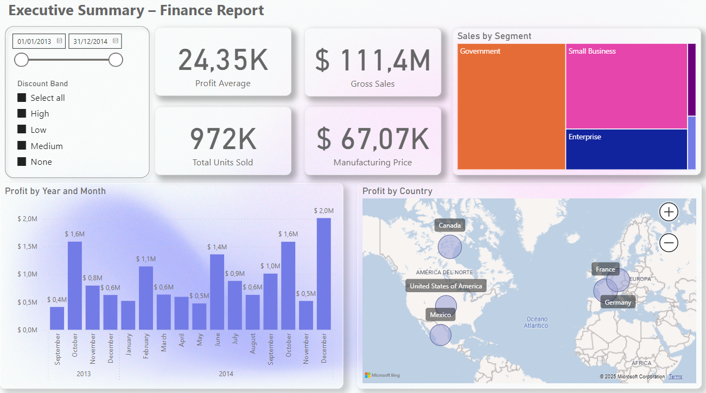

# 📊 Power BI Finance Dashboard - Executive Summary

This repository contains an interactive **Power BI dashboard** designed to deliver a clear and actionable **executive financial summary**. It helps decision-makers monitor key financial metrics at a glance.

---

## ✨ Features

- 📈 **Revenue and Expense Analysis**  
  Track income, costs, and profit margins over time.

- 💰 **Key Financial KPIs**  
  Visualize operating income, net income, and EBITDA.

- 🌍 **Regional or Department Breakdown**  
  Understand how performance varies by business unit, location, or product line.

- 📅 **Time Trends**  
  Filter financial data by year, quarter, or month.

- ⚙️ **Dynamic Filters**  
  Use slicers to drill down on relevant segments.

---

## 🗂️ Files Included

- `Executive Summary – Finance Report.pbix` — The Power BI file.
- `README.md` — This file.

---

## 📸 Dashboard Preview

Add a screenshot here!  
You can include one like this:  
```markdown

